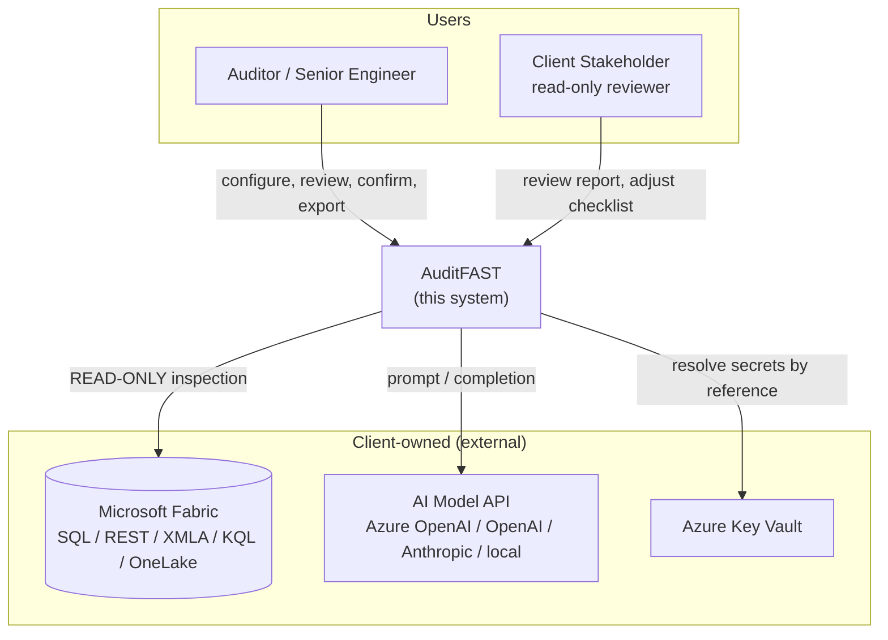
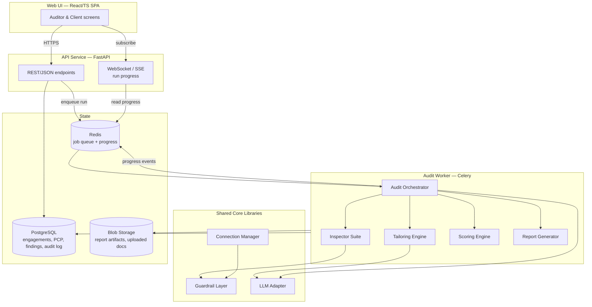
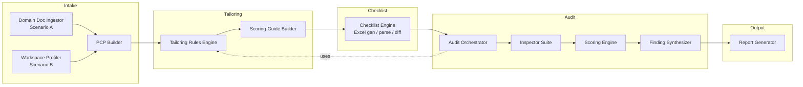
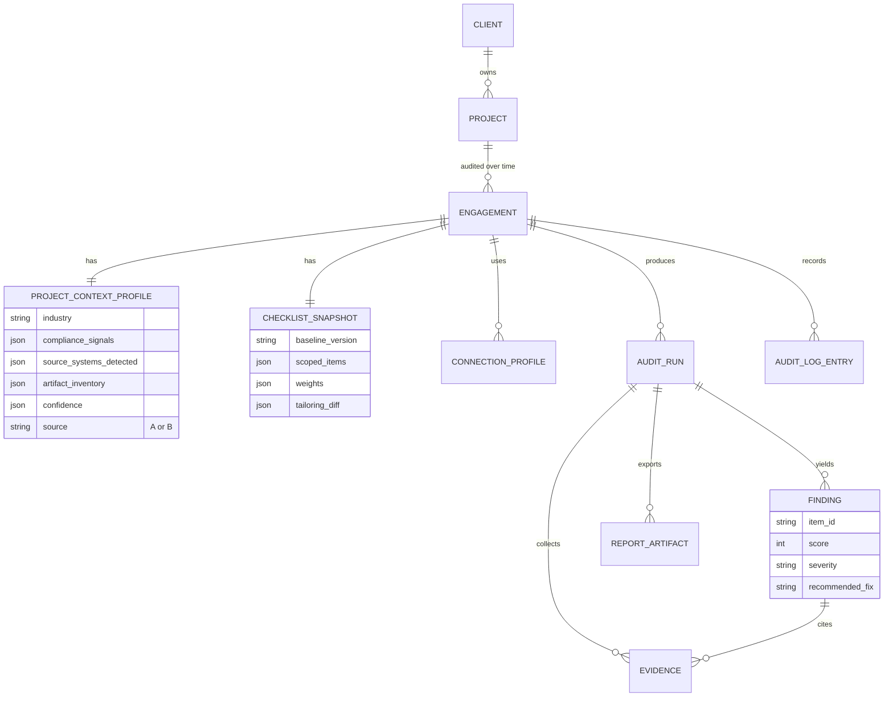
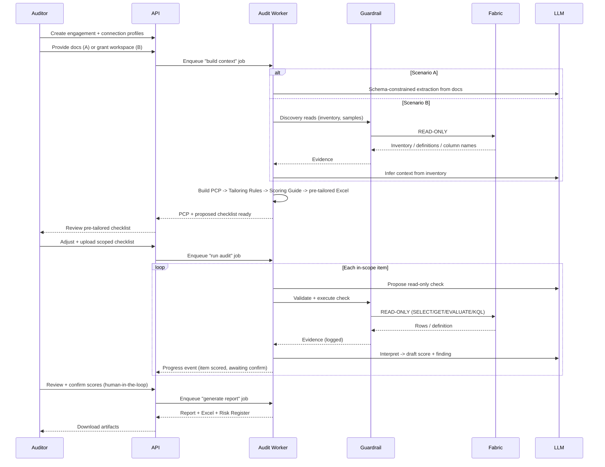
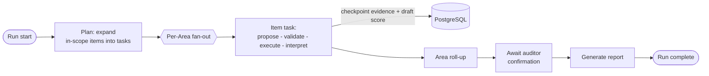
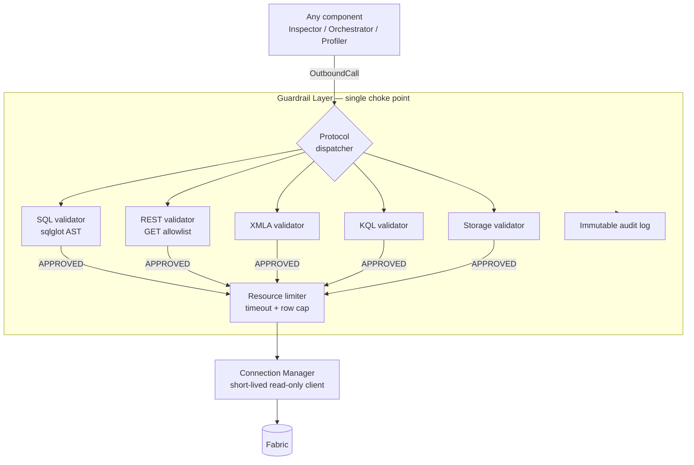

# AuditFAST — High-Level Design (HLD)

---

## Document Control

| Field | Value |
|-------|-------|
| Document | **High-Level Design (HLD)** |
| Product | AuditFAST — AI-Powered Microsoft Fabric Migration Auditor |
| Companion documents | Product spec (working doc), `10-technical-architecture-document.md` (TAD) |
| Audience | Engineering leads, senior developers, reviewers implementing the system |
| Scope | System-level design: module decomposition, responsibilities, interfaces, control/data flow, and key sequences. **Not** infrastructure/deployment (see TAD) and **not** class-level detail (see LLD, produced per module at build time). |
| Status | Draft for review |

> **How to read this alongside the other docs.** The **product spec** answers *what* AuditFAST is and *why*. This **HLD** answers *how the software is structured and how the pieces talk to each other*. The **TAD** answers *how it is built, secured, deployed, and operated*. Where the spec and HLD overlap (e.g., the six pillars, the guardrail layers, the Project Context Profile), the spec is the source of truth for intent and this HLD is the source of truth for structure.

---

## 1. Design Goals & Constraints

| # | Goal / Constraint | Design implication |
|---|-------------------|--------------------|
| G1 | **Read-only, always** — the tool must be physically unable to write to client systems | A single, mandatory, non-bypassable Guardrail layer sits between *every* component and *every* external Fabric protocol. No component holds a direct Fabric client handle. |
| G2 | **Two input scenarios, one downstream** — domain docs (A) or workspace inference (B) | Both scenarios converge on one **Project Context Profile (PCP)** schema; nothing downstream branches on scenario. |
| G3 | **Repeatable across a stream of engagements** | Engagement is a first-class, isolated aggregate; no global mutable state; runs are resumable jobs. |
| G4 | **Provider-agnostic AI, bring-your-own-key** | AI access is behind one `LLMAdapter` port; providers are pluggable; no provider SDK leaks past the adapter. |
| G5 | **Explainable tailoring & scoring** | Every auto-decision (in-scope, weight, score) carries a cited rationale; deterministic rules preferred over LLM judgment wherever possible. |
| G6 | **Human-in-the-loop** | No AI output (context, score, finding) is finalized without an explicit auditor confirmation step in the workflow. |
| G7 | **Long-running, observable audits** | The audit is an orchestrated job with per-Area/per-item progress, retryable steps, and an immutable audit log. |

These seven goals are the acceptance criteria against which every design decision below is justified.

---

## 2. System Context (C4 Level 1)



**Trust boundaries.** AuditFAST treats **all three external systems as outside its trust boundary**. Fabric responses are untrusted data (prompt-injection risk, Section 8). Secrets are never held by AuditFAST — they are resolved by reference from the client's Key Vault at call time. The AI model is a stateless reasoning service that receives only sanitized, minimized evidence.

---

## 3. Container View (C4 Level 2)



| Container | Runtime | Responsibility | Why separate |
|-----------|---------|----------------|--------------|
| **Web UI** | Browser SPA | All auditor/client interaction; renders checklist tree, run dashboard, report viewer | Independent release cadence from backend |
| **API Service** | FastAPI (async) | Request handling, auth, validation, enqueue runs, stream progress, serve read models | Must stay responsive; never blocks on a long audit |
| **Audit Worker** | Celery worker(s) | Executes the long-running audit job graph | Scales independently under audit load; failure isolated from API |
| **Shared Core** | Python libs imported by both API & Worker | Guardrail, LLM Adapter, Connection Manager — the safety- and provider-critical code | Single auditable code path, reused, never duplicated |
| **State** | PostgreSQL / Redis / Blob | Durable engagement data / job queue+progress / large artifacts | Standard separation of relational, ephemeral, and blob data |

> **Design rule:** the Guardrail, LLM Adapter, and Connection Manager are the only code allowed to open an outbound connection to an external system. Every other component depends on them through an interface (Section 6) and can never construct a raw client itself. This is what makes the read-only guarantee reviewable in one place.

---

## 4. Module Decomposition (C4 Level 3)

The Audit Worker is where the domain logic lives. It decomposes into seven modules plus three shared-core modules.



### 4.1 Module responsibilities & key decisions

| Module | Responsibility | Key design decision |
|--------|----------------|---------------------|
| **Domain Doc Ingestor** (A) | Parse uploaded docs → extract PCP fields via schema-constrained LLM call | Uses JSON-mode / function-calling so the model returns only PCP fields + confidence, never free text |
| **Workspace Profiler** (B) | Run Inspectors in *discovery mode* (inventory → definition sampling → column-name sampling) → PCP fields | Reuses the **same** Inspector code as the audit, at lower depth; never a separate un-guardrailed path |
| **PCP Builder** | Normalize either source into the canonical `ProjectContextProfile`; attach confidence + evidence refs; flag `needs_review` fields | The single convergence point for Scenario A/B (Goal G2) |
| **Tailoring Rules Engine** | Map PCP → per-item `in_scope`, `weight`, `custom items`, each with a cited rationale | Deterministic rules table first; LLM only for ambiguous cases, and only as a `needs_review` proposal |
| **Scoring-Guide Builder** | Compute per-Area weights via versioned PCP multipliers; set pass/fail thresholds | Weights from a versioned lookup table, not free-form LLM output, so scores stay comparable across engagements |
| **Checklist Engine** | Generate pre-tailored Excel (13 sheets + Config); parse & validate uploads; diff human edits vs. proposal | Excel and in-app checkbox tree are two views over the same `ChecklistScope` model |
| **Audit Orchestrator** | Drive the run Area-by-Area/item-by-item; request evidence; coordinate Inspectors + LLM + Scoring; emit progress; checkpoint | Deterministic job graph (Section 7); each item is an independently retryable unit of work |
| **Inspector Suite** | One read-only inspector per Fabric artifact type; return normalized `Evidence` | Common `Inspector` interface (Section 6.2); artifact-specific logic isolated per inspector |
| **Scoring Engine** | Apply 0–3 rubric + category/area/overall roll-up + risk bands, using the project scoring guide | Pure, deterministic given (evidence, scoring guide); fully unit-testable without external calls |
| **Finding Synthesizer** | Turn low scores into structured `Finding` blocks with recommended fixes | LLM drafts; output is a typed `Finding`, not prose, so the report is assembled from data |
| **Report Generator** | Render Markdown/PDF report + Excel checklist + Excel risk register from findings | Templates (Jinja) are versioned; report is a deterministic render of the `Findings` set |
| **Shared: Guardrail** | Validate every outbound call per protocol; enforce read-only, single-statement, resource limits; log | Sole owner of the "is this call safe" decision (Section 8) |
| **Shared: LLM Adapter** | Provider-agnostic prompt/response; prompt-injection filtering of Fabric-sourced data | Sole owner of AI access; swaps provider without touching callers |
| **Shared: Connection Manager** | Resolve/validate connection profiles; fetch secrets by Key Vault reference; hand short-lived clients to the Guardrail only | Sole owner of credential resolution; secrets never returned to callers |

---

## 5. Core Domain Model

The persistent state (detailed physical schema in the TAD) centers on these aggregates. Fields shown are illustrative, not exhaustive.



**Aggregate boundaries.** `Engagement` is the transactional boundary — a run mutates only its own engagement's records. This is what delivers Goal G3 (isolation across a stream of engagements) and enables Phase-3 cross-run diffing within a single `Project`.

---

## 6. Key Interfaces (Ports)

These are the seams that keep the system testable and the safety-critical code centralized. All are Python `Protocol`/ABC ports with multiple implementations.

### 6.1 Guardrail port

```python
class Guardrail(Protocol):
    def validate(self, call: OutboundCall) -> GuardResult:
        """Return APPROVED or REJECTED(reason). Never executes the call."""

    def execute(self, call: OutboundCall) -> RawResult:
        """Validate THEN execute, under resource limits, logging both.
        The only function in the codebase permitted to hit an external
        Fabric protocol. Raises if validate() rejects."""
```

`OutboundCall` is a tagged union over protocols: `SqlQuery`, `RestRequest(method, path)`, `XmlaRequest`, `KqlQuery`, `StorageRequest`. Each protocol has its own validator (SQL via `sqlglot` AST, REST via method allowlist, etc. — Section 8). There is deliberately **no** `Guardrail.write(...)` — the write path does not exist (guardrail layer L6).

### 6.2 Inspector port

```python
class Inspector(Protocol):
    artifact_type: ArtifactType
    def discover(self, ctx: EngagementCtx) -> InventorySlice:
        """Cheap, read-only: counts, names, connector types. Feeds the PCP (Scenario B)."""
    def inspect(self, ctx: EngagementCtx, item: ChecklistItem) -> list[Evidence]:
        """Full read-only evidence collection for one checklist item."""
```

Every inspector goes through the Guardrail for external access; it never opens its own connection. Adding a new Fabric artifact type = adding one `Inspector` implementation and registering it — no orchestrator changes.

### 6.3 LLM Adapter port

```python
class LLMAdapter(Protocol):
    def extract(self, schema: JsonSchema, docs: list[Document]) -> StructuredResult:
        """Schema-constrained extraction (PCP building, Scenario A)."""
    def propose_check(self, item: ChecklistItem, ctx: EngagementCtx) -> ProposedCheck:
        """Suggest a read-only check; result MUST pass the Guardrail before use."""
    def interpret(self, item: ChecklistItem, evidence: list[Evidence]) -> DraftScore: ...
    def synthesize_finding(self, item: ChecklistItem, score: DraftScore) -> DraftFinding: ...
```

All Fabric-sourced text passed into these methods is first run through the prompt-injection filter (Section 8). Providers (Azure OpenAI / OpenAI / Anthropic / local) are concrete implementations selected by the engagement's AI connection profile.

### 6.4 Checklist port

```python
class ChecklistStore(Protocol):
    def generate_workbook(self, scope: ChecklistScope) -> Xlsx: ...
    def parse_workbook(self, file: bytes) -> ChecklistScope: ...   # validates + rejects macros/links
    def diff(self, proposed: ChecklistScope, uploaded: ChecklistScope) -> ScopeDiff: ...
```

---

## 7. Primary Control Flows

### 7.1 End-to-end engagement (happy path)



### 7.2 Audit run as a resumable job graph

The "run audit" job is not a single function — it is a checkpointed graph so a worker crash resumes from the last completed item, not the start.



Each **Item task** is idempotent and independently retryable: given the same engagement + item + connection, re-running it re-collects evidence and re-derives the draft score without side effects (reads only). Transient Fabric/LLM failures retry with backoff; a permanently failing item is marked `evidence_unavailable` and surfaced to the auditor rather than silently skipped.

---

## 8. Guardrail Design (structural view)

The guardrail's *policy* (allow/block lists per protocol) is fully specified in the product spec's guardrail section. This HLD specifies its *structure* — how it is positioned so it cannot be bypassed.



**Why it cannot be bypassed (design-level, mapped to spec's L1–L7):**
- Callers receive an `OutboundCall` *description*, never a live client (L4/L6). Only `Guardrail.execute` obtains a client, and only from the Connection Manager, which only ever issues **read-only** credentials (L1).
- Every validator runs on the request *before* any client is touched; rejection raises before execution (L2/L3).
- The prompt-injection filter sits inside the LLM Adapter so Fabric-sourced text is neutralized before reaching the model (L5).
- The audit log records validate + execute for every call, immutably (L7).
- Architecturally, there is **no** function anywhere that performs a write on any protocol. A code review or static check can assert this by confirming `Guardrail.execute` is the only external-call site and it contains no write branch (L6).

---

## 9. Cross-Cutting Design Concerns (summary; detail in TAD)

| Concern | HLD-level decision |
|---------|--------------------|
| **Concurrency** | Item tasks within an Area fan out concurrently up to a per-engagement cap; the Resource Limiter bounds concurrent Fabric calls to protect the client system. |
| **Idempotency** | Every job task is keyed by `(run_id, item_id, attempt-invariant)`; re-execution is safe because all external work is read-only. |
| **Progress & observability** | Orchestrator emits typed progress events to Redis; API relays via SSE/WebSocket; every step also lands in the audit log. |
| **Error taxonomy** | `GuardrailRejection` (never retried — it's a correctness signal), `TransientExternalError` (retry w/ backoff), `EvidenceUnavailable` (surface to auditor), `LLMSchemaViolation` (re-prompt once, then flag). |
| **Human-in-the-loop gates** | Two mandatory gates: (1) PCP/checklist review before the run, (2) score confirmation before report generation. Neither can be skipped by config. |
| **Extensibility** | New artifact = new `Inspector`; new AI provider = new `LLMAdapter`; new compliance regime = new rows in the tailoring rules + scoring-multiplier tables. No orchestrator change in any of these cases. |

---

## 10. Traceability — Requirements → Design

| Product-spec requirement | Realized by (this HLD) |
|--------------------------|------------------------|
| Generate project-specific checklist & scoring guide | 4 Tailoring Rules Engine + Scoring-Guide Builder; 7.1 context-build flow |
| Scenario A (domain docs) | 4 Domain Doc Ingestor; 6.3 `LLMAdapter.extract`; 7.1 alt-A |
| Scenario B (workspace inference) | 4 Workspace Profiler; 6.2 `Inspector.discover`; 7.1 alt-B |
| Perform the audit against artifacts | 4 Audit Orchestrator + Inspector Suite; 7.1/7.2 |
| Single report: findings + scores + fixes | 4 Scoring Engine + Finding Synthesizer + Report Generator |
| Read-only, never writes | 3 choke-point rule; 6.1 Guardrail port (no write method); 8 |
| Repeatable across many engagements | 5 Engagement aggregate; 7.2 resumable jobs |
| Bring-your-own AI | 6.3 `LLMAdapter` port; provider selected per engagement |
| Explainable decisions | 4 cited rationale on every auto-decision; deterministic rules first |

---

## 11. Open Design Questions (for review)

1. **XMLA access in Python** — confirm whether `pyadomd` is production-viable or whether the .NET XMLA-reader sidecar (TAD) is required from Phase 2. Affects the Semantic Model Inspector's packaging.
2. **Orchestrator engine** — Celery for MVP is assumed here; if human-in-the-loop pauses become long-lived (days), evaluate Temporal earlier than Phase 3 (7.2 would become durable workflow steps).
3. **Evidence retention** — how long is collected `Evidence` retained per engagement, given PII minimization? Proposed default: purge row-level evidence on report finalization, keep aggregates + citations. Needs client-policy input.
4. **Checklist baseline versioning** — how baseline checklist version upgrades apply to in-flight engagements (pin at engagement creation vs. offer migration). Proposed: pin at creation.

---

*Prepared by MAQ Software — Fabric Practice. This HLD is a design artifact for AuditFAST and is subordinate to the product spec for intent and to the TAD for infrastructure, security operations, and deployment.*
