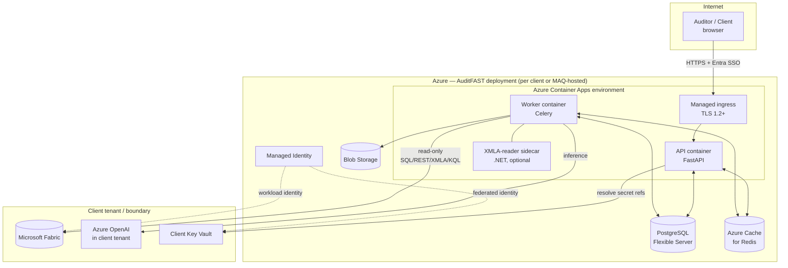
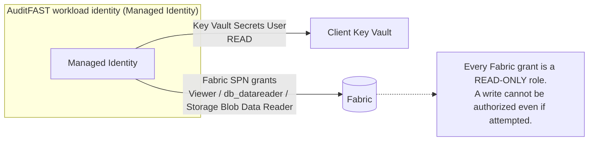

# AuditFAST — Technical Architecture Document (TAD)

---

## Document Control

| Field | Value |
|-------|-------|
| Document | **Technical Architecture Document (TAD)** |
| Product | AuditFAST — AI-Powered Microsoft Fabric Migration Auditor |
| Companion documents | Product spec (working doc), `09-high-level-design.md` (HLD) |
| Audience | Architects, DevOps/platform engineers, security reviewers, infrastructure owners |
| Scope | The *technical* architecture: technology stack rationale, deployment topology, infrastructure, security architecture, data architecture, integration patterns, non-functional requirements, observability, and operations. **Not** module-level design (see HLD) or business intent (see product spec). |
| Status | Draft for review |

> **Positioning.** The **HLD** describes *how the software is structured* (modules, interfaces, flows). This **TAD** describes *how that software is realized as a running, secured, operated system* — the runtime platform, the network and identity boundaries, how the read-only guarantee is enforced at the infrastructure level, and how the system meets its non-functional requirements.

---

## 1. Architectural Principles

| # | Principle | Consequence |
|---|-----------|-------------|
| AP1 | **Read-only is a platform property, not just app logic** | Enforced in *depth*: least-privilege identities at the cloud/IAM layer back up the in-app Guardrail. Even if the app were compromised, the granted role cannot write. |
| AP2 | **Zero standing secrets** | No client secret is stored by AuditFAST. Secrets live in the client's Key Vault and are resolved at call time via the tool's Managed Identity. |
| AP3 | **Client data stays in the client boundary** | Recommended topology keeps Fabric access and (with Azure OpenAI) inference inside the client tenant/region; the tool ships minimized evidence only. |
| AP4 | **Engagement isolation** | Each engagement is logically isolated (row-level tenancy) with a path to physical isolation (dedicated deployment) for high-security clients. |
| AP5 | **Stateless compute, durable state** | API and Worker containers are stateless and horizontally scalable; all state is in managed data services. |
| AP6 | **Auditable by construction** | Every external call and every AI interaction is logged immutably; the architecture makes "prove it never wrote" answerable from the logs and the IAM grants. |
| AP7 | **Single safety choke point** | All outbound Fabric access funnels through one Guardrail component (HLD §8); infrastructure reinforces this by giving only that path network egress to Fabric. |

---

## 2. Technology Stack & Rationale

| Layer | Technology | Rationale |
|-------|-----------|-----------|
| **Frontend** | React 18 + TypeScript + Vite; headless component kit (Radix/shadcn) | Standard MAQ web stack; custom-fittable audit dashboard and checklist tree |
| **API service** | Python 3.12 + FastAPI (ASGI, async) | Best ecosystem for the two hardest parts — LLM orchestration and Fabric SQL/REST/KQL tooling; async fits fan-out read workloads |
| **Background execution** | Celery + Redis broker/result backend | Durable, resumable, observable long-running audit jobs; low infra friction for MVP |
| **SQL guardrail parsing** | `sqlglot` (AST-based, dialect-aware) | Parse-then-validate beats regex; catches multi-statement, comment-hidden, and `SELECT…INTO` attacks |
| **Fabric connectivity** | `pyodbc`/TDS (SQL), `httpx` + `msal` (REST + OAuth2 client credentials), `azure-kusto-data` (KQL), `azure-storage-file-datalake` (OneLake) | Native, well-supported clients per protocol |
| **XMLA / semantic model** | `pyadomd` default; thin **.NET 8 XMLA-reader sidecar** as fallback | Only place lacking a first-class pure-Python client; isolated behind the Inspector interface |
| **Excel checklist** | `openpyxl` | Generate 13-sheet workbook, parse uploads, reject macros/external links |
| **Reporting** | Jinja2 → HTML → Playwright (headless Chromium) for PDF | Report templates versioned as text, not binary Office files |
| **Persistence** | Azure Database for PostgreSQL Flexible Server; `SQLAlchemy` + `Alembic` | Relational core with JSONB for PCP/evidence payloads; migrations in code |
| **Cache / queue** | Azure Cache for Redis | Celery broker + progress event bus |
| **Blob storage** | Azure Blob Storage | Uploaded docs, generated report/Excel artifacts |
| **Secrets** | Azure Key Vault + Managed Identity | Matches the audit's own best-practice checks; zero standing secrets (AP2) |
| **Identity (app users)** | Microsoft Entra ID (SSO, OIDC) | Enterprise-standard auth for who may log in and run audits |
| **Hosting** | Azure Container Apps (separate revisions: API, Worker) | MAQ-standard Azure hosting; independent scaling; managed ingress + TLS |
| **IaC** | Bicep (or Terraform) | Reproducible per-tenant environment provisioning |
| **CI/CD** | Azure DevOps / GitHub Actions | Build, test, guardrail security tests, container publish, deploy |

> The stack recommendation and the .NET-alternative trade-off are argued in full in the product spec's Technology Stack section; this TAD treats Python/FastAPI as the decided baseline and describes the resulting architecture.

---

## 3. Deployment Topology

### 3.1 Recommended: single-tenant per client (default for regulated engagements)

### 3.2 Topology options

| Model | Isolation | When to use |
|-------|-----------|-------------|
| **Multi-tenant SaaS** | Logical (row-level tenancy, per-engagement encryption context) | Lower-sensitivity engagements; fastest onboarding |
| **Single-tenant (recommended)** | Dedicated deployment + data store per client | Regulated clients (HIPAA/SOX); keeps data in client region |
| **On-prem / air-gapped** | Fully within client network; local/self-hosted LLM (M5) | Maximum-security clients; "Paranoid" guardrail mode |

The same container images serve all three; only IaC parameters and the AI-provider profile differ.

---

## 4. Security Architecture

Security is the defining concern for this product. It is layered across identity, network, the in-app guardrail, and data.

### 4.1 Identity & access (defense-in-depth for read-only, AP1)

- **App users** authenticate via **Entra ID SSO**; RBAC inside the app distinguishes Auditor (run/confirm/export) from Client Reviewer (review-only).
- **The tool's workload identity** holds only: Key Vault *read*, and Fabric *read-only* roles. This is the primary backstop (guardrail L1): the identity is incapable of writing regardless of app behavior.
- **Client secrets** (Fabric SPN, AI key) are referenced (`keyvault://…`), never stored. Resolved at call time via the Managed Identity.

### 4.2 The read-only guarantee — enforced at two independent layers

| Layer | Mechanism | Failure mode it covers |
|-------|-----------|------------------------|
| **Infrastructure (this TAD)** | Least-privilege read-only IAM roles on every Fabric surface | App bug, compromise, or logic error that emits a write — Fabric rejects it |
| **Application (HLD §8, spec guardrail section)** | Guardrail validates every call per protocol before execution; no write path in code | A write is stopped before it ever leaves the tool, with an audit-log record |

Neither layer trusts the other; a bypass of one is still caught by the second. Security tests (Section 9) assert both independently.

### 4.3 Network

- **Egress control:** only the Worker container has network egress to Fabric/AI endpoints, and (where the platform supports it) egress is restricted to the specific Fabric/Azure OpenAI FQDNs — reinforcing the single choke point (AP7).
- **Private connectivity:** Private Endpoints for PostgreSQL, Redis, Blob, and Key Vault so state services are not exposed to the public internet.
- **Ingress:** managed TLS 1.2+ termination at Container Apps ingress; HSTS; no plaintext.

### 4.4 Data protection

| Data class | At rest | In transit | Retention |
|-----------|---------|-----------|-----------|
| Config / connection profiles (secret **references** only) | AES-256 (platform-managed keys; CMK option) | TLS 1.2+ | Life of engagement |
| Project Context Profile, findings, scores | AES-256 | TLS 1.2+ | Life of engagement + report |
| Row-level evidence (potential PII) | AES-256; masked/truncated | TLS 1.2+ | **Purged on report finalization** by default (HLD §11 Q3) |
| Audit log | AES-256, append-only/immutable store | TLS 1.2+ | Long-lived (compliance) |
| Report artifacts | AES-256 in Blob | TLS 1.2+ | Per engagement policy |

- **PII minimization:** evidence is masked/truncated before persistence or transmission to the model; Scenario B discovery matches column *names*, never row values, unless explicitly enabled (spec).
- **Prompt-injection defense:** all Fabric-sourced text is treated as untrusted and filtered in the LLM Adapter before reaching the model.

---

## 5. Data Architecture

### 5.1 Stores

| Store | Purpose | Notes |
|-------|---------|-------|
| **PostgreSQL** | System of record: clients, projects, engagements, PCP, checklist snapshots, evidence metadata, findings, audit log | JSONB for PCP/evidence payloads; relational for the aggregates in HLD §5 |
| **Redis** | Celery broker + result backend; progress event bus for SSE/WebSocket | Ephemeral; no source-of-truth data |
| **Blob Storage** | Uploaded domain docs (Scenario A), generated report/Excel/risk-register artifacts | Lifecycle policies per retention table |

### 5.2 Multi-tenancy & isolation

- **Row-level tenancy** keyed by `client_id` / `engagement_id` on every table; all queries are tenant-scoped at the repository layer.
- **Per-engagement isolation** for connections, logs, and evidence (spec requirement) — no cross-engagement joins in application code.
- **Physical isolation** available via single-tenant deployment (Section 3.2) for clients who require it.

### 5.3 Audit log

Append-only, tamper-evident (hash-chained entries), covering: every connection test, every `OutboundCall` (validate result + execute result), every AI call (prompt hash + provider + token counts, not raw PII), and every score change with user + timestamp. This is what makes AP6 ("prove it never wrote") answerable.

---

## 6. Integration Architecture

| Integration | Protocol / auth | Direction | Guardrail policy |
|-------------|-----------------|-----------|------------------|
| Fabric SQL endpoint (F1) | TDS/ODBC, SPN read-only | Outbound, read-only | SQL validator: `SELECT`-family only |
| Fabric REST API (F2) | HTTPS, OAuth2 client credentials | Outbound, read-only | REST validator: `GET` only |
| Power BI XMLA (F3) | XMLA/ADOMD, SPN | Outbound, read-only | XMLA validator: discovery + `EVALUATE` only |
| OneLake / ADLS (F4) | HTTPS, MI/SPN Storage *Reader* | Outbound, read-only | Storage validator: read/list only |
| Eventhouse / KQL (F6) | Kusto, SPN viewer | Outbound, read-only | KQL validator: tabular queries + `.show` |
| Git / Deployment (F7) | HTTPS, read-only PAT/SPN | Outbound, read-only | Read/clone only |
| Azure Key Vault | HTTPS, Managed Identity | Outbound, read | Secrets read only |
| AI model (M1–M5) | HTTPS, key/MI | Outbound | Sanitized evidence out; provider-agnostic adapter |

All integrations are **outbound and read-only**; AuditFAST exposes no inbound integration surface to client systems.

---

## 7. Non-Functional Requirements

| NFR | Target | How the architecture meets it |
|-----|--------|-------------------------------|
| **Security (read-only)** | Zero writes to client systems, always | Dual-layer enforcement (§4.2); 100% of write attempts blocked in security tests (§9) |
| **Performance** | API p95 < 300 ms for interactive endpoints | Async FastAPI; long work offloaded to Worker; API never blocks on audits |
| **Scalability** | Many concurrent engagements; large workspaces | Stateless containers scale horizontally; Worker scales independently; per-engagement concurrency cap protects the client |
| **Availability** | Business-hours SLA for MVP; HA option later | Managed Azure services; multi-replica API; Worker retries; resumable jobs survive restarts |
| **Resilience** | No lost audit progress on crash | Checkpointed job graph (HLD §7.2); idempotent, read-only tasks safe to retry |
| **Client-system safety** | Never overload client Fabric | Resource Limiter: query timeout (default 30s), row cap (default 10k), concurrency cap |
| **Auditability** | Full non-repudiation | Immutable hash-chained audit log (§5.3) |
| **Data residency** | Data stays in client region/tenant | Single-tenant topology + Azure OpenAI in client tenant (§3.2, AP3) |
| **Maintainability** | Add artifact/provider without core changes | Port-based extensibility (HLD §6) |
| **Portability** | Cloud, single-tenant, and air-gapped from one codebase | Same images; IaC-parameterized; local-LLM option |

---

## 8. Observability & Operations

| Concern | Approach |
|---------|----------|
| **Logging** | Structured JSON logs → Azure Monitor / Log Analytics; correlation IDs per engagement/run/item |
| **Metrics** | Run duration, items/sec, guardrail rejections, LLM latency/tokens, Fabric call latency, queue depth |
| **Tracing** | OpenTelemetry spans across API → Worker → Guardrail → external call |
| **Progress UX** | Redis progress events surfaced to the UI via SSE/WebSocket (HLD §9) |
| **Alerting** | Alert on any guardrail rejection spike, Worker failure rate, queue backlog, Key Vault resolution failure |
| **Health** | Liveness/readiness probes on API and Worker; dependency checks (PG/Redis/Blob/KV) |
| **Backup/DR** | PostgreSQL PITR; Blob soft-delete + versioning; IaC enables clean environment rebuild |
| **Cost** | Bring-your-own AI key means client bears inference cost; capacity-aware scaling on Container Apps |

---

## 9. Security Testing & Verification (release gate)

The read-only guarantee is a release blocker, so it is tested explicitly, not assumed:

| Test class | What it asserts |
|-----------|-----------------|
| **Guardrail unit tests** | Every blocked keyword/pattern per protocol (SQL/REST/XMLA/KQL/Storage/Git) is rejected; every allowed read-only form passes |
| **Injection corpus** | Multi-statement, stacked queries, comment-obfuscated writes, `SELECT…INTO`, dynamic SQL — all rejected |
| **Prompt-injection tests** | Malicious instructions embedded in simulated Fabric data do not cause a write proposal to be executed |
| **IAM verification** | The granted Fabric role is proven read-only (a write attempt against a test workspace is rejected by Fabric itself) |
| **No-write static check** | CI asserts `Guardrail.execute` is the only external-call site and contains no write branch (guardrail L6) |
| **End-to-end read-only proof** | Full audit run against a test workspace produces zero write operations in Fabric's own logs |

**Gate:** 100% of write/DDL/DML attempts blocked, at both the app and IAM layers, before any connection to a real client system.

---

## 10. Environments & Delivery

| Environment | Purpose | Fabric target |
|-------------|---------|---------------|
| **Dev** | Feature development | Mock/sandbox Fabric workspace |
| **Test / Security** | Guardrail penetration + integration tests (§9) | Dedicated test workspace with deliberately writable + read-only roles to prove enforcement |
| **Staging** | Pre-prod validation | Anonymized/sample workspace |
| **Prod (per client)** | Live engagements | Client's Fabric (read-only SPN) |

**Pipeline:** build → unit/integration tests → **guardrail security suite (blocking)** → container publish → IaC deploy → smoke test. The guardrail suite is a hard gate; a failure blocks release.

---

## 11. Phased Infrastructure Rollout

| Phase | Infrastructure scope |
|-------|----------------------|
| **Phase 1 (MVP)** | Single Container Apps env (API + Worker), PostgreSQL, Redis, Blob, Key Vault, Entra SSO; Fabric SQL (F1) + REST (F2); Azure OpenAI (M1); guardrail L1/L2/L3/L6/L7 + security suite |
| **Phase 2** | XMLA sidecar, KQL/OneLake/Git connectivity, Private Endpoints hardening, full guardrail set (L4/L5, resource limits, PII masking), CMK option |
| **Phase 3** | Multi-tenant SaaS packaging + single-tenant/on-prem IaC variants, local-LLM path, HA/DR posture, cross-run delta reporting storage, optional Temporal-based orchestration |

---

## 12. Risks (technical) & Mitigations

| Risk | Mitigation |
|------|------------|
| A write reaches client data | Dual-layer read-only (§4.2); read-only IAM is the primary backstop; blocking security gate (§9) |
| XMLA client instability in Python | .NET XMLA-reader sidecar fallback, isolated behind the Inspector interface |
| Long human-in-the-loop pauses exceed Celery's model | Checkpointed resumable jobs now; Temporal evaluation in Phase 3 |
| Secret leakage | Zero standing secrets (AP2); Key Vault references; Private Endpoints; no secrets in logs |
| Overloading client Fabric | Resource Limiter (timeout/row/concurrency caps); per-engagement concurrency budget |
| Prompt injection via table data | Untrusted-data handling + LLM-cannot-execute design; tested with an injection corpus |
| Cross-engagement data leakage | Row-level tenancy enforced at repository layer; single-tenant option for high-security clients |

---

*Prepared by MAQ Software — Fabric Practice. This TAD is the technical/infrastructure authority for AuditFAST and is subordinate to the product spec for intent and complementary to the HLD for software structure.*
